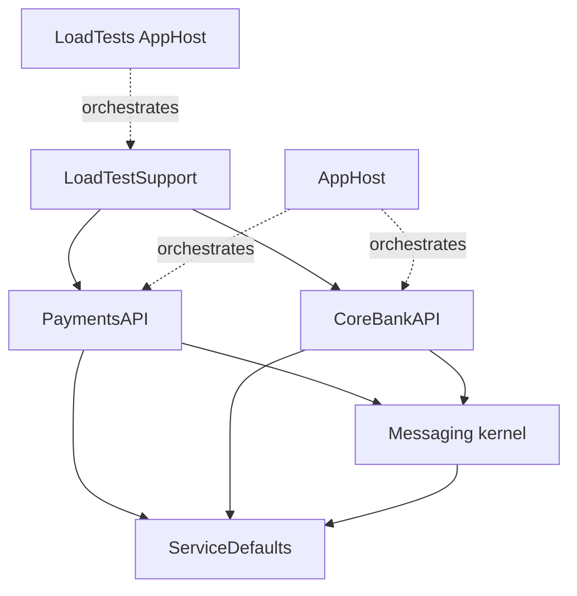
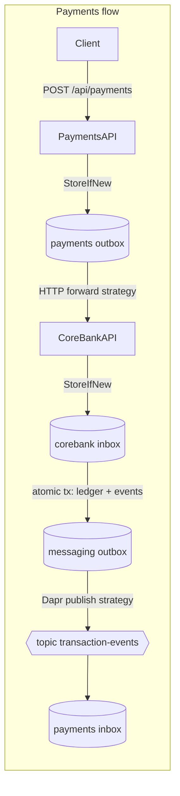

# Architecture Spine — CoreBankDemo Rebuild

## Design Paradigm

**Hexagonal (ports & adapters) per service, over a shared messaging kernel.**

- **Domain/application core** (handlers, executors, validators, publishers): pure logic, constructor-injected ports, no framework types beyond `ILogger`/`TimeProvider`. Lives in `Handlers/`, `Inbox/`, `Outbox/`, `Models/` of each API project.
- **Inbound adapters**: ASP.NET controllers (thin — bind, call, map result) and Dapr subscription endpoints. Live in `Controllers/`.
- **Outbound adapters**: EF Core repositories, HTTP clients, Dapr publisher, Dapr lock service. Implement the ports; own all raw SQL and network I/O.
- **Messaging kernel** (`CoreBankDemo.Messaging`): the reusable Inbox/Outbox machinery every processor builds on.

## Invariants & Rules

### AD-1 — External contract frozen `[ADOPTED]`

- **Binds:** all
- **Prevents:** scope creep; breaking the demo flows and load harness
- **Rule:** Endpoints, ports (5294/5295, 5032, 5181), Dapr pubsub `pubsub` / topic `transaction-events`, CloudEvent types, seeded accounts, and response semantics are exactly those in `constraints.md` §2. Behavior changes require an ADR.

### AD-2 — Logic is unit-testable by construction

- **Binds:** all production projects
- **Prevents:** logic trapped in controllers/adapters where it can't meet the 90% gate
- **Rule:** Controllers contain no business logic (bind → call handler → map). Application classes depend only on ports + `TimeProvider` + `ILogger<T>`, constructor-injected. Any class needing infrastructure to test is an adapter and must stay logic-free.

### AD-3 — One messaging kernel, four processors

- **Binds:** PaymentsAPI Outbox/Inbox, CoreBankAPI Inbox/MessagingOutbox
- **Prevents:** divergent poll/lock/retry implementations (the `main` MessagingOutboxProcessor defect, ruling A2)
- **Rule:** Every background processor derives from `InboxProcessorBase`/`OutboxProcessorBase` in `CoreBankDemo.Messaging`. Message delivery is a port (`IOutboxDeliveryStrategy`): HTTP-forward and Dapr-publish are strategies, not new processor loops. No processor re-implements polling, partition fan-out, locking, batching, claiming, **stale-claim reclaim** (Processing older than `ProcessingTimeout` returns to Pending), retry, or trace restoration — all of these are kernel-owned.

### AD-4 — Idempotency key is the single identity

- **Binds:** all message stores and processors
- **Prevents:** incompatible dedupe/ordering schemes between services
- **Rule:** The idempotency key is a **string** (client `Idempotency-Key` header, or generated GUID-formatted; equals `TransactionId` at CoreBankAPI) and is the **ordering identity** everywhere: `PartitionId = FNV-1a(key) % PartitionCount`, `PartitionCount = 4` (ruling A3), defined by one validated option per service that must equal 4 at startup. The **dedupe identity is per store**: command stores (payments outbox, corebank inbox) dedupe on the key alone; event stores dedupe on the composite event identity — messaging outbox `(TransactionId, EventType, AccountNumber?)`, payments inbox the same composite as inbox key — because one transaction legitimately yields three events. Idempotent stores use `StoreIfNewAsync` (unique index + violation catch), never check-then-insert.

### AD-5 — State changes and their events commit atomically

- **Binds:** CoreBankAPI transaction execution; all outbox writes
- **Prevents:** lost or phantom events; double execution
- **Rule:** Ledger mutation, inbox completion (with cached response), and domain-event enqueue commit in **one** DB transaction. No network I/O inside a DB transaction. Events reach the broker only via an outbox processor after commit.

### AD-6 — Fixed port set for infrastructure

- **Binds:** all production projects
- **Prevents:** untestable seams; hidden infrastructure coupling (ruling A6)
- **Rule:** Infrastructure is reached only through these ports: `IDistributedLockService`, `IEventPublisher` (wraps `DaprClient`), `ICoreBankApiClient` (single HTTP implementation — ruling A1: the `Features:UseDapr` flag and phantom Dapr client are deleted), repository interfaces per aggregate/store, and `TimeProvider`. Raw SQL (`SELECT … FOR UPDATE`) exists only inside repository implementations.

### AD-7 — Locking is expiry-based, not renewed

- **Binds:** messaging kernel, ServiceDefaults
- **Prevents:** half-wired renewal config resurfacing (ruling A4)
- **Rule:** Partition locks rely on expiry plus cooperative cancellation at 5/6 of lock lifetime. `LockRenewIntervalSeconds` is deleted, not wired. Options classes contain no unused members; every option is read by code or does not exist.

### AD-8 — Trace context survives every hop

- **Binds:** all message stores, HTTP client, event publisher, processors
- **Prevents:** broken traces (NFR-2)
- **Rule:** `TraceParent`/`TraceState` are persisted on every message row, propagated on the HTTP hop (headers) and Dapr hop (CloudEvent metadata), and restored as span parent when processing. New spans follow the `observability` skill (registered `ActivitySource`, naming, tags incl. `IdempotencyKey`/`PartitionId`).

### AD-9 — Test architecture and coverage gate

- **Binds:** all test projects; rulings A7/A8
- **Prevents:** coverage theater; untestable-by-accident code; SQLite/Postgres semantic confusion
- **Rule:** Three tiers: (1) pure logic tested with Moq against ports; (2) repository/store behavior tested on EF Core SQLite in-memory; (3) Postgres-only semantics covered solely by the k6/Postgres acceptance tier. To keep tiers 2 and 3 separable, repositories are written provider-agnostic (LINQ, EF unique-violation detection via a shared provider-aware helper) except **minimal pass-through methods** embedding provider-specific SQL (`FOR UPDATE`); those pass-throughs contain no logic and may carry individual `[ExcludeFromCodeCoverage]` with a justifying comment — never a blanket class-level exclusion. Coverage: coverlet.msbuild in `tests/Directory.Build.props`, `Threshold=90`, `ThresholdType=line`; hosting wiring carries `[ExcludeFromCodeCoverage]`. The gate must pass from plain `dotnet test` on the rebuild solution filter, running the **VSTest runner mode** — Microsoft.Testing.Platform must not be enabled (coverlet is incompatible with MTP; the gate would silently vanish).

### AD-10 — Rebuild gate is the solution filter

- **Binds:** build/CI process during rebuild
- **Prevents:** fighting red builds across unmigrated projects
- **Rule:** All story/epic gates run against `CoreBankDemo.Rebuild.slnf`. Projects enter the filter at the start of their epic (old sources deleted, tests added first). The full `.sln` is only required green once AppHost's epic completes.

### AD-11 — Delivery outcome contract

- **Binds:** outbox delivery strategies; CoreBankAPI intake; message statuses
- **Prevents:** incompatible retry/poison interpretations between the forwarding side and the receiving side
- **Rule:** Message `Status` values are **transport states only** (Pending/Processing/Completed/Failed). A business rejection (invalid account, insufficient funds) is a **successfully processed** message: the inbox row completes with a cached failure `ResponsePayload` and a `TransactionFailed` event — it is never `Failed` and never retried. `Failed` means the transport gave up after `MaxRetryCount`. Delivery classification for the HTTP strategy: any 2xx (including duplicate-accepted) → `Completed`; anything else (4xx, 5xx, timeout, exception) → return to `Pending` with `RetryCount++`, terminal `Failed` after `MaxRetryCount`. A duplicate arriving while the original is still in flight receives `202` with current (pending) status — replay of the cached response applies only after completion.

### AD-12 — Wire contracts have one written owner

- **Binds:** both APIs, ServiceDefaults, LoadTestSupport
- **Prevents:** silently diverging request/response/event shapes once `main`'s code is deleted mid-rebuild
- **Rule:** Event payload records (`TransactionCompletedEvent`, `TransactionFailedEvent`, `BalanceUpdatedEvent`) live **once** in ServiceDefaults `CloudEventTypes` and are the only event shapes on the wire. HTTP request/response DTO classes stay per-service (services never share an API contract assembly), but their JSON shapes are fixed verbatim in the epics tech-spec (extracted from `main` before demolition); a DTO change is a contract change requiring an ADR (AD-1).

### Dependency direction



Arrows are the only permitted project references. `Messaging` and `ServiceDefaults` never reference an API project; APIs never reference each other (they interact only via HTTP/pub-sub); `LoadTestSupport` may reference both APIs' DbContexts (assertion side-car exemption).

## Consistency Conventions

| Concern | Convention |
| --- | --- |
| Message statuses / limits | `MessageConstants` only (Pending/Processing/Completed/Failed, MaxRetryCount 5, BatchSize 10, ProcessingTimeout 5 min); no string/number literals |
| CloudEvent types | Constants in ServiceDefaults `CloudEventTypes` (`com.corebank.transaction.completed` / `.failed` / `com.corebank.account.balance.updated`) |
| Persistence | EF Core + Npgsql, `Database.EnsureCreated()` only — never migrations; unique index enforces idempotency |
| Time | Injected `TimeProvider` everywhere; `DateTime.Now/UtcNow` forbidden |
| Validation | DataAnnotations-validated options bound fail-fast at startup; request validation returns all errors as `BadRequest(new { Errors })` |
| Logging | `ILogger<T>` structured, always including `IdempotencyKey` and `PartitionId` where applicable |
| Packages | Central package management via `Directory.Packages.props` only |
| Lock names | `<prefix>-partition-<id>` with per-store prefixes: `payments-outbox`, `payments-inbox`, `corebank-inbox`, `corebank-messaging-outbox` — never shared between stores |
| Seed data | One owner per dataset: CoreBankAPI startup seeds the 3 demo accounts; LoadTestSupport owns the 10 `NL..LOAD` accounts (seed + reset) |
| Tests | xUnit `[Fact]`/`[Theory]`, AwesomeAssertions `Should()` syntax, Moq for ports; test names state the pattern contract being proven |

## Stack

Test packages verified current on NuGet 2026-08-21; production pins carried unchanged from `Directory.Packages.props` (they intentionally lag latest — upgrading is out of scope).

| Name | Version |
| --- | --- |
| .NET / ASP.NET Core | 10.0 |
| Aspire | 13.4.0 |
| EF Core + Npgsql provider | 10.0.8 / 10.0.2 |
| Dapr.AspNetCore / Dapr.Client | 1.17.9 |
| CloudNative.CloudEvents | 2.8.0 |
| OpenTelemetry | 1.15.x |
| xunit.v3 | 4.0.0 |
| xunit.runner.visualstudio | 4.0.0 |
| Microsoft.NET.Test.Sdk | 18.9.0 |
| AwesomeAssertions | 9.6.0 |
| Moq | 4.20.72 |
| coverlet.collector / coverlet.msbuild | 10.0.1 |
| Microsoft.EntityFrameworkCore.Sqlite (tests only) | 10.0.8 (pinned to EF Core family) |

## Structural Seed

```text
CoreBankDemo/
  CoreBankDemo.Messaging/            # kernel: processor bases, repository bases, MessageConstants, PartitionHelper, IOutboxDeliveryStrategy
  CoreBankDemo.ServiceDefaults/      # OTel/Polly wiring, IDistributedLockService (+Dapr impl), options bases, CloudEventTypes
  CoreBankDemo.CoreBankAPI/          # ledger service: Controllers/ Inbox/ Outbox/ Models/
  CoreBankDemo.PaymentsAPI/          # intake service: Controllers/ Handlers/ Inbox/ Outbox/ Models/
  CoreBankDemo.AppHost/              # Aspire orchestration + optional DevProxy
  CoreBankDemo.LoadTests/            # load-test AppHost + k6 container
  CoreBankDemo.LoadTestSupport/      # assertion API + MCP server (references both DbContexts)
  tests/
    Directory.Build.props            # coverlet gate: Threshold=90, line
    CoreBankDemo.Messaging.Tests/
    CoreBankDemo.ServiceDefaults.Tests/
    CoreBankDemo.CoreBankAPI.Tests/
    CoreBankDemo.PaymentsAPI.Tests/
  CoreBankDemo.Rebuild.slnf          # rebuild gate (AD-10)
```



## Capability → Architecture Map

| Capability (PRD) | Lives in | Governed by |
| --- | --- | --- |
| 4.1 Payment intake | PaymentsAPI Controllers + Handlers | AD-1, AD-2, AD-4 |
| 4.2 Reliable forwarding | PaymentsAPI Outbox + kernel | AD-3, AD-4, AD-6, AD-8 |
| 4.3 Idempotent processing | CoreBankAPI Controllers + Inbox | AD-1, AD-4, AD-5 |
| 4.4 Account services | CoreBankAPI Controllers + Models | AD-1, AD-2 |
| 4.5 Event publishing | CoreBankAPI Outbox + kernel | AD-3, AD-5, AD-8 |
| 4.6 Event consumption | PaymentsAPI Inbox + kernel | AD-3, AD-4, AD-8 |
| 4.7 Messaging library | Messaging | AD-3, AD-4, AD-6, AD-9 |
| 4.8 Orchestration & chaos | AppHost, ServiceDefaults | AD-1, AD-7 |
| 4.9 Load harness | LoadTestSupport, LoadTests, k6 | AD-1 (conforms to code) |
| 4.10 Test suite & gate | tests/ | AD-2, AD-9, AD-10 |

## Deferred

- **Story-level cuts per epic** — owned by `bmad-create-epics-and-stories`; the epic order (E0–E7) is fixed in the brief addendum.
- **Exact repository interface shapes** — emerge per story under AD-6; the spine fixes only that they exist and own raw SQL.
- **LoadTestSupport schema adaptation details** — E6 conforms to whatever E1–E4 produced (user decision; AD-1 keeps assertion semantics).
- **k6 script parameters** — carry over from `main` unless the harness realignment forces change.
- **ADR texts for A1–A4 + test strategy** — written in the docs epic (E7) from this spine's memlog.
- **Deployment/operations envelope** — none beyond Aspire local orchestration; demo-only by PRD non-goal, deliberately unowned.
