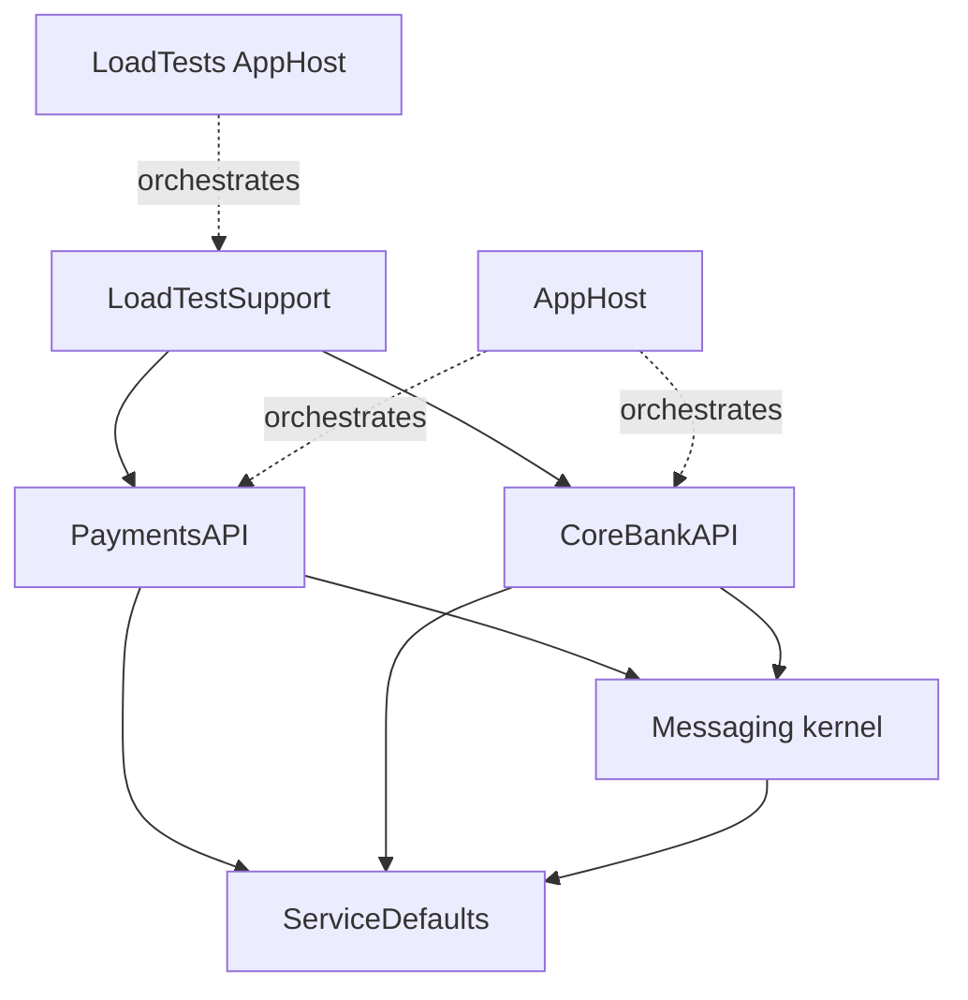
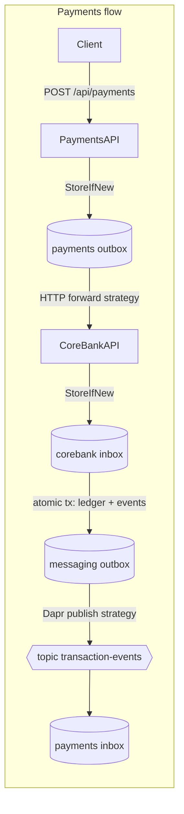

# Architecture Spine — CoreBankDemo Rebuild

## Design Paradigm

**Hexagonal (ports & adapters) per service, over a shared messaging kernel.**

- **Domain/application core** (handlers, executors, validators, publishers): pure logic, constructor-injected ports, no framework types beyond `ILogger`/`TimeProvider`. Lives in `Handlers/`, `Inbox/`, `Outbox/`, `Models/` of each API project.
- **Inbound adapters**: ASP.NET controllers (thin — bind, call, map result) and Dapr subscription endpoints. Live in `Controllers/`.
- **Outbound adapters**: EF Core repositories, HTTP clients, Dapr publisher, Redis lock service. Implement the ports; own all raw SQL and network I/O.
- **Messaging kernel** (`CoreBankDemo.Messaging`): the reusable Inbox/Outbox machinery every processor builds on.

## Invariants & Rules

### AD-1 — External contract frozen `[ADOPTED]`

- **Binds:** all
- **Prevents:** scope creep; breaking the demo flows and load harness
- **Rule:** Endpoints, ports (5294/5295, 5032, 5181), Dapr pubsub `pubsub` / topic `transaction-events`, CloudEvent types, seeded accounts, and response semantics are exactly those in `constraints.md` §2. Behavior changes require an ADR.

### AD-2 — Logic is unit-testable by construction

- **Binds:** all production projects
- **Prevents:** logic trapped in controllers/adapters where it can't meet the 90% gate
- **Rule:** Controllers contain no business logic (bind → call handler → map). Application classes depend only on ports + `TimeProvider` + `ILogger<T>`, constructor-injected. Any class needing infrastructure to test is an adapter and must stay logic-free.

### AD-3 — One messaging kernel, four processors

- **Binds:** PaymentsAPI Outbox/Inbox, CoreBankAPI Inbox/MessagingOutbox
- **Prevents:** divergent poll/lock/retry implementations (the `main` MessagingOutboxProcessor defect, ruling A2)
- **Rule:** Every background processor derives from `InboxProcessorBase`/`OutboxProcessorBase` in `CoreBankDemo.Messaging`. Message delivery is a port (`IOutboxDeliveryStrategy`): HTTP-forward and Dapr-publish are strategies, not new processor loops. No processor re-implements polling, partition fan-out, locking, batching, claiming, **stale-claim reclaim** (Processing older than `ProcessingTimeout` returns to Pending), retry, or trace restoration — all of these are kernel-owned.
- **Scale-out invariant:** The distributed lock store is shared by every replica. At most one service instance may process a given store partition at a time, preserving durable enqueue order across competing instances even when ordering timestamps tie; locks remain partition-scoped so different partitions can progress concurrently.

### AD-4 — Idempotency key is the single identity

- **Binds:** all message stores and processors
- **Prevents:** incompatible dedupe/ordering schemes between services
- **Rule:** The idempotency key is a **string** (client `Idempotency-Key` header, or generated GUID-formatted; equals `TransactionId` at CoreBankAPI) and is the **ordering identity** everywhere: `PartitionId = FNV-1a(key) % PartitionCount`, `PartitionCount = 4` (ruling A3), defined by one validated option per service that must equal 4 at startup. The **dedupe identity is per store**: command stores (payments outbox, corebank inbox) dedupe on the key alone; event stores dedupe on the composite event identity — messaging outbox `(TransactionId, EventType, AccountNumber?)`, payments inbox the same composite as inbox key — because one transaction legitimately yields three events. Idempotent stores use `StoreIfNewAsync` (unique index + violation catch), never check-then-insert.

### AD-5 — State changes and their events commit atomically

- **Binds:** CoreBankAPI transaction execution; all outbox writes
- **Prevents:** lost or phantom events; double execution
- **Rule:** Ledger mutation, inbox completion (with cached response), and domain-event enqueue commit in **one** DB transaction. No network I/O inside a DB transaction. Events reach the broker only via an outbox processor after commit.

### AD-6 — Fixed port set for infrastructure

- **Binds:** all production projects
- **Prevents:** untestable seams; hidden infrastructure coupling (ruling A6)
- **Rule:** Infrastructure is reached only through these ports: `IDistributedLockService`, `IEventPublisher` (wraps `DaprClient`), `ICoreBankApiClient` (single Kiota-backed HTTP adapter — ruling A1: the `Features:UseDapr` flag, phantom Dapr client, and parallel hand-written HTTP implementation are deleted), repository interfaces per aggregate/store, and `TimeProvider`. Raw SQL (`SELECT … FOR UPDATE`) exists only inside repository implementations.
- **Generated client boundary:** CoreBankAPI owns `CoreBankDemo.CoreBankAPI/OpenApi/corebank-api.json`, a checked-in OpenAPI document containing every public account and transaction operation. PaymentsAPI runs a repository-pinned Kiota version from an incremental MSBuild target before compilation, clears obsolete output when regeneration is required, and writes the C# transport client beneath `$(IntermediateOutputPath)`; generated sources are never committed or exposed to handlers. The adapter resolves the logical `corebank-api` Aspire endpoint rather than a replica address, maps generated models and transport outcomes to application-owned types, propagates `traceparent`/`tracestate`, and applies AD-11 response classification.

### AD-7 — Locking uses renewable Redis leases `[AMENDED BY ADR-011]`

- **Binds:** messaging kernel, ServiceDefaults
- **Prevents:** work outliving an unrenewed lease; half-wired renewal config resurfacing (ruling A4)
- **Rule:** `IDistributedLockService` uses `DistributedLock.Redis` over the Aspire-managed Redis connection. Acquisition is non-blocking; the finite lease renews automatically while the handle is healthy; caller cancellation or `HandleLostToken` cancels cooperative work. `LockRenewIntervalSeconds` does not exist because cadence is adapter/library-owned. Dapr remains the event-publishing adapter, not the lock adapter.

### AD-8 — Trace context survives every hop

- **Binds:** all message stores, HTTP client, event publisher, processors
- **Prevents:** broken traces (NFR-2)
- **Rule:** `TraceParent`/`TraceState` are persisted on every message row, propagated on the HTTP hop (headers) and Dapr hop (CloudEvent metadata), and restored as span parent when processing. New spans follow the `observability` skill (registered `ActivitySource`, naming, tags incl. `IdempotencyKey`/`PartitionId`).

### AD-9 — Test architecture and coverage gate

- **Binds:** all test projects; rulings A7/A8
- **Prevents:** coverage theater; untestable-by-accident code; provider-semantic confusion (a second database engine standing in for PostgreSQL)
- **Rule (amended by ADR-016, 2026-08-30 — supersedes the original SQLite tier 2):** Three tiers: (1) **unit** — pure logic tested with Moq against ports, including Kiota generated-client compilation and adapter mapping/classification tests; runs with **no Docker**, selected by `CoreBankDemo.UnitTests.slnf`. (2) **persistence integration** — EF Core models, repositories, durable stores, seeding, transactions, `SELECT ... FOR UPDATE`, Npgsql SQLSTATE classification, ordering/claiming and data-type round trips, all against **real PostgreSQL via Testcontainers** (`postgres:18.3`, pinned to the AppHost major), selected by `CoreBankDemo.IntegrationTests.slnf`. (3) **distributed acceptance** — Redis-, replicated-topology-, and end-to-end semantics covered by the k6/Aspire tier. SQLite, EF Core InMemory, and any other relational engine are forbidden as PostgreSQL substitutes. The persistence tier uses one container per test assembly (never per test case), a freshly created database per test method for isolation without disabling parallelism, generated host ports only, and bounded startup/lock waits; it is never silently skipped when Docker is missing. Repositories stay provider-agnostic (LINQ, EF unique-violation detection via a shared helper keyed on `PostgresException.SqlState`) except **minimal pass-through methods** embedding provider-specific SQL (`FOR UPDATE`); those are now proved directly at tier 2 and carry no coverage exclusion. Coverage: coverlet.msbuild in `tests/Directory.Build.props`, `Threshold=90`, `ThresholdType=line`, partitioned between tiers by the shared `$(PersistenceTierFilters)` list so every applicable type is measured exactly once at >=90% with no blanket exclusions; hosting wiring carries `[ExcludeFromCodeCoverage]`, while generated code is excluded through coverlet configuration. The gate must pass from plain `dotnet test` on the rebuild solution filter (which runs **both** the unit and persistence tiers), running the **VSTest runner mode** — Microsoft.Testing.Platform must not be enabled (coverlet is incompatible with MTP; the gate would silently vanish). Replicated acceptance tests use real Postgres and the renewable Redis lock adapter, identify which replica processed each message, and prove same-partition exclusion and durable ordering plus concurrent progress on different partitions; lock-loss cancellation and renewal receive a real-Redis proof.

### AD-10 — Rebuild gate is the solution filter

- **Binds:** build/CI process during rebuild
- **Prevents:** fighting red builds across unmigrated projects
- **Rule:** All story/epic gates run against `CoreBankDemo.Rebuild.slnf`. Projects enter the filter at the start of their epic (old sources deleted, tests added first). The full `.sln` is only required green once AppHost's epic completes.

### AD-11 — Delivery outcome contract

- **Binds:** outbox delivery strategies; CoreBankAPI intake; message statuses
- **Prevents:** incompatible retry/poison interpretations between the forwarding side and the receiving side
- **Rule:** Message `Status` values are **transport states only** (Pending/Processing/Completed/Failed). A business rejection (invalid account, insufficient funds) is a **successfully processed** message: the inbox row completes with a cached failure `ResponsePayload` and a `TransactionFailed` event — it is never `Failed` and never retried. `Failed` means the transport gave up after `MaxRetryCount`. Delivery classification for the HTTP strategy: any 2xx (including duplicate-accepted) → `Completed`; anything else (4xx, 5xx, timeout, exception) → return to `Pending` with `RetryCount++`, terminal `Failed` after `MaxRetryCount`. A duplicate arriving while the original is still in flight receives `202` with current (pending) status — replay of the cached response applies only after completion.

### AD-12 — Wire contracts have one written owner

- **Binds:** both APIs, ServiceDefaults, LoadTestSupport
- **Prevents:** silently diverging request/response/event shapes once `main`'s code is deleted mid-rebuild
- **Rule:** Event payload records (`TransactionCompletedEvent`, `TransactionFailedEvent`, `BalanceUpdatedEvent`) live **once** in ServiceDefaults `CloudEventTypes` and are the only event shapes on the wire. HTTP request/response DTO classes stay per-service (services never share an API contract assembly), but their JSON shapes are fixed verbatim in the epics tech-spec (extracted from `main` before demolition); a DTO change is a contract change requiring an ADR (AD-1). CoreBankAPI's checked-in OpenAPI document is the written machine-readable owner for those HTTP operations and must describe all public endpoints without changing the frozen shapes. Generated-client compilation and adapter tests replace any CI live-contract-diff requirement.

### AD-13 — Local topology is replicated behind stable ingress `[ADOPTED]`

- **Binds:** regular AppHost, LoadTests AppHost, both APIs, Dapr sidecars
- **Prevents:** single-instance-only ordering proof; clients binding to ephemeral replica endpoints
- **Rule:** Both AppHosts run two PaymentsAPI replicas and two CoreBankAPI replicas by default. Aspire's proxy preserves the documented PaymentsAPI entry ports (5294 regular, 5295 load test), and service-to-service calls resolve the logical `corebank-api` endpoint; clients never bind to a replica and no gateway is introduced. Replicas of one service share its database, logical Dapr app id, pubsub, and Aspire-managed Redis lock store while sidecar/runtime ports remain replica-unique. Concurrent empty-database startup must be race-safe. In the load-test graph, APIs run their existing schema initialization while their hosted processors wait on a load-test-only start gate. After API and LoadTestSupport health, a one-shot initializer resets the databases, releases every processor gate, and completes before k6 starts. The regular AppHost leaves the gate open. The four-partition model is unchanged.

### AD-14 — Presentation console is a standalone, allow-listed local tool `[ADOPTED — ADR-015]`

- **Binds:** `CoreBankDemo.DemoRunner`, its scenario files, tests
- **Prevents:** banking-product UI scope creep from the PRD's "no UI" non-goal; scenario-supplied shell/process/database/URL execution; direct store access from a presentation tool
- **Rule:** `CoreBankDemo.DemoRunner` is a standalone net10.0 console (Terminal.Gui pinned centrally at `2.4.17`) with no project reference to any banking implementation project, `DbContext`, or Redis/Dapr/container-engine client. It interacts only through stable local HTTP endpoints and a fingerprinted, ownership-tracked Aspire child-process adapter, driven by a closed set of allow-listed scenario action kinds (`selectTopology`, `waitForHealth`, `sendHttp`, `runAcceptedLoadWorkflow`, `assertHttp`, `openKnownUrl`, `speakerPause`). It reuses Story 7.1–7.3's LoadTestSupport/k6 workflow for the load cue rather than a parallel assertion path, gates narrative advancement on proven evidence (never elapsed time or log text), and never becomes a prerequisite for development, tests, or the banking services. `demo-requests.http`/`payment-idempotency-tests.http` remain the unchanged manual fallback.

### Dependency direction



Arrows are the only permitted project references. `Messaging` and `ServiceDefaults` never reference an API project; APIs never reference each other (they interact only via HTTP/pub-sub); `LoadTestSupport` may reference both APIs' DbContexts (assertion side-car exemption).

## Consistency Conventions

| Concern | Convention |
| --- | --- |
| Message statuses / limits | `MessageConstants` only (Pending/Processing/Completed/Failed, MaxRetryCount 5, BatchSize 10, ProcessingTimeout 5 min); no string/number literals |
| CloudEvent types | Constants in ServiceDefaults `CloudEventTypes` (`com.corebank.transaction.completed` / `.failed` / `com.corebank.account.balance.updated`) |
| Persistence | EF Core + Npgsql, `Database.EnsureCreated()` only — never migrations; unique index enforces idempotency |
| Time | Injected `TimeProvider` everywhere; `DateTime.Now/UtcNow` forbidden |
| Validation | DataAnnotations-validated options bound fail-fast at startup; request validation returns all errors as `BadRequest(new { Errors })` |
| Logging | `ILogger<T>` structured, always including `IdempotencyKey` and `PartitionId` where applicable |
| Packages | Central package management via `Directory.Packages.props` only |
| Lock names | `<prefix>-partition-<id>` with per-store prefixes: `payments-outbox`, `payments-inbox`, `corebank-inbox`, `messaging-outbox` — never shared between stores |
| Seed data | One owner per dataset: CoreBankAPI startup seeds the 3 demo accounts; LoadTestSupport owns the 10 `NL..LOAD` accounts (seed + reset) |
| Tests | xUnit `[Fact]`/`[Theory]`, AwesomeAssertions `Should()` syntax, Moq for ports; test names state the pattern contract being proven |

## Stack

Test packages verified current on NuGet 2026-08-21; production pins carried unchanged from `Directory.Packages.props` (they intentionally lag latest — upgrading is out of scope).

| Name | Version |
| --- | --- |
| .NET / ASP.NET Core | 10.0 |
| Aspire | 13.4.0 |
| EF Core + Npgsql provider | 10.0.8 / 10.0.2 |
| Dapr.AspNetCore / Dapr.Client | 1.17.9 |
| Aspire.StackExchange.Redis / DistributedLock.Redis | 13.4.0 / 1.1.1 |
| CloudNative.CloudEvents | 2.8.0 |
| OpenTelemetry | 1.15.x |
| xunit.v3 | 4.0.0 |
| xunit.runner.visualstudio | 4.0.0 |
| Microsoft.NET.Test.Sdk | 18.9.0 |
| AwesomeAssertions | 9.6.0 |
| Moq | 4.20.72 |
| coverlet.collector / coverlet.msbuild | 10.0.1 |
| Testcontainers.PostgreSql (tests only) | 4.14.0 |
| Testcontainers.XunitV3 (tests only) | 4.14.0 |
| PostgreSQL container image (AppHost + persistence tier) | `postgres:18.3` |

## Structural Seed

```text
CoreBankDemo/
  CoreBankDemo.Messaging/            # kernel: processor bases, repository bases, MessageConstants, PartitionHelper, IOutboxDeliveryStrategy
  CoreBankDemo.ServiceDefaults/      # OTel/Polly wiring, IDistributedLockService (+Redis impl), Dapr event publisher, options, CloudEventTypes
  CoreBankDemo.CoreBankAPI/          # ledger service: Controllers/ Inbox/ Outbox/ Models/
  CoreBankDemo.PaymentsAPI/          # intake service: Controllers/ Handlers/ Inbox/ Outbox/ Models/
  CoreBankDemo.AppHost/              # Aspire orchestration + optional DevProxy
  CoreBankDemo.LoadTests/            # load-test AppHost + k6 container
  CoreBankDemo.LoadTestSupport/      # assertion API + MCP server (references both DbContexts)
  tests/
    Directory.Build.props            # coverlet gate: Threshold=90, line
    CoreBankDemo.Messaging.Tests/
    CoreBankDemo.ServiceDefaults.Tests/
    CoreBankDemo.CoreBankAPI.Tests/
    CoreBankDemo.PaymentsAPI.Tests/
  CoreBankDemo.Rebuild.slnf          # rebuild gate (AD-10)
```



## Capability → Architecture Map

| Capability (PRD) | Lives in | Governed by |
| --- | --- | --- |
| 4.1 Payment intake | PaymentsAPI Controllers + Handlers | AD-1, AD-2, AD-4 |
| 4.2 Reliable forwarding | PaymentsAPI Outbox + kernel | AD-3, AD-4, AD-6, AD-8, AD-12 |
| 4.3 Idempotent processing | CoreBankAPI Controllers + Inbox | AD-1, AD-4, AD-5 |
| 4.4 Account services | CoreBankAPI Controllers + Models | AD-1, AD-2 |
| 4.5 Event publishing | CoreBankAPI Outbox + kernel | AD-3, AD-5, AD-8 |
| 4.6 Event consumption | PaymentsAPI Inbox + kernel | AD-3, AD-4, AD-8 |
| 4.7 Messaging library | Messaging | AD-3, AD-4, AD-6, AD-9 |
| 4.8 Orchestration & chaos | AppHost, ServiceDefaults | AD-1, AD-7, AD-13 |
| 4.9 Load harness | LoadTestSupport, LoadTests, k6 | AD-1, AD-9, AD-13 (conforms to code) |
| 4.10 Test suite & gate | tests/ | AD-2, AD-9, AD-10 |
| 4.11 Presentation demo console | CoreBankDemo.DemoRunner | AD-1, AD-9, AD-10, AD-14 (standalone, allow-listed, no banking references) |

## Deferred

- **Story-level cuts per epic** — owned by `bmad-create-epics-and-stories`; the epic order (E0–E7) is fixed in the brief addendum.
- **Exact repository interface shapes** — emerge per story under AD-6; the spine fixes only that they exist and own raw SQL.
- **LoadTestSupport schema adaptation details** — E6 conforms to whatever E1–E4 produced (user decision; AD-1 keeps assertion semantics).
- **k6 script parameters** — carry over from `main` unless the harness realignment forces change.
- **ADR implementation completion** — ADR-008..ADR-015 are accepted; their remaining code and orchestration work is owned by the corresponding stories.
- **Deployment/operations envelope** — none beyond Aspire local orchestration; demo-only by PRD non-goal, deliberately unowned.
